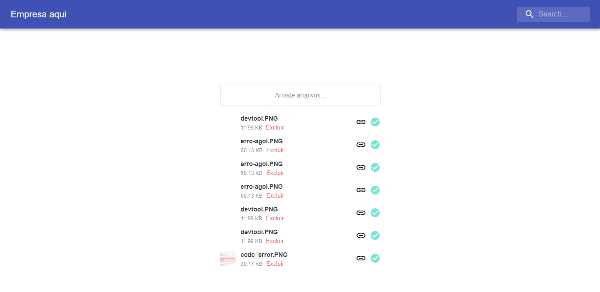

# reactjs-s3-spaces-folder


## Stack
- Reactjs
- Nodejs
- MongoDB

## How to
1. criar arquivo `.env` e alterá-lo conforme o `env-sample`
2. Subir o mongoDB
    - estou usando através do docker
    - a ideia é usar container para toda a aplicação

Baixar a imagem, é oficial no dockerhub
```
docker pull mongo
```

Subir o banco. São essas credenciais usadas no `.env`
```
docker run -v ~/docker --name mongodb -p 27017:27017 -e MONGO_INITDB_ROOT_USERNAME=user -e MONGO_INITDB_ROOT_PASSWORD=user mongo
```

3. Subir o backend
```
cd spaces-backend
npm run dev  # nodemon e logs no console
```

4. Subir frontend
você deve estar na pasta raíz.
preciso configurar as portas ainda, então vc receberá uma mensagem no terminal para acessar a aplicação em uma porta diferente da `3000`, apenas digite `y`
```
cd spaces-frontend
npm start
```

## notas
1. tem alguma coisa sobre ACL que preciso configurar no s3, as imagens estão bloqueadas para acesso.

2. não estou usando typescript, estava tomando muito tempo focar em aprender a sintaxe

3. Endpoints disponíveis:
    - auth:
        - login
        - signup
            - cria o vhost do usuário no bucket. vhost == folder
    - criação pastas no bucket
        - recebe o caminho e o nome da pasta
    - upload de arquivos
        - recebe o arquivo, o nome do arquivo e o caminho de onde será salvo
    - listar conteúdos do bucket
        - recebe o caminho que deve ser mostrado as pastas e/ou arquivos

4. A interface não está funcional
    - não soube com fazer a criação de pastas
    - o upload de arquivos quebrou, não foi possível corrigir ainda
    - para listar o conteúdo de uma pasta na interface é preciso passar o nome da pasta ou deixar vazio para listar a raiz

5. funcionalidade a desenvolver na interface
    - criar pastas
    - listar conteúdos das pastas
    - navegar entra as pastas
    - upload de arquivos
    - filtro de busca
    - logout

6. funcionalidades a desenvolver no backend
    - acredito que a forma como o banco está modelado pode ser melhorada
    - link para os arquivos, o ACL do s3 bloqueou e não está sendo possível visualizar um arquivo

7. aprendi muita coisa sobre react e node
    - o padrão de projeto que está definido agora pode ser melhorado, preciso me aprofundar mais nisso
    - configurações de um app react e node
    - integração com banco de dados
    - roteamento, urls...
    - promisses, tipos de funções e escopo do JavaScript
    - hooks: useState, useEffect...
    - integração com S3

8. Considerações
    - tive alguns desafios usando React. Vou me aprofundar mais em ReactJs
    - A aplicação não está funcional. eu poderia ter controlado melhor o tempo, achei que hoje seria possível concluir o MVP. Farei melhor na próxima